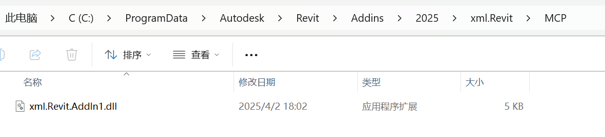

# 如何创建和生成 MCP DLL 文件以供 CallFunc 调用

本文档介绍如何创建一个 MCP DLL 文件，以供 CallFunc 方法调用。
MCP DLL 文件需要实现接口 xml.Revit.MCP.Public.IMCPMethod，
并按照 JSON-RPC 2.0 规范与 Revit 的 MCP 服务进行交互。

## MCP DLL 的结构和实现

创建一个实现类

实现 `IMCPMethod` 接口

以下是一个实现类的示例，用于创建标高并返回新标高`ElementModelRequest`：

```C#
using System;
using System.Collections.Generic;
using System.Diagnostics;
using System.Linq;
using System.Threading;
using System.Threading.Tasks;
using Autodesk.Revit.DB;
using Autodesk.Revit.DB.Architecture;
using Autodesk.Revit.DB.Structure;
using Autodesk.Revit.UI;
using Newtonsoft.Json;
using Newtonsoft.Json.Linq;
using xml.Revit.MCP.Models;
using xml.Revit.MCP.Public;
using xml.Revit.Toolkit.Attributes;
using xml.Revit.Toolkit.Extensions;
using xml.Revit.Toolkit.Utils;

namespace xml.Revit.MCPServer
{
    /// <summary>
    /// 实现新增标高功能的类，继承自 IMCPMethod 接口。
    /// </summary>
    public sealed class TopLevelAdd : IMCPMethod
    {
        /// <summary>
        /// 构造函数，初始化方法名称。
        /// </summary>
        public TopLevelAdd()
        {
            MethodName = "新增标高";
        }

        /// <summary>
        /// 方法名称，用于标识当前功能。
        /// </summary>
        public string MethodName { get; private set; }

        /// <summary>
        /// 执行新增标高的核心逻辑。
        /// </summary>
        /// <param name="request">包含请求参数的 JsonRPCRequest 对象。</param>
        /// <param name="uidoc">当前 Revit 的 UIDocument 对象。</param>
        /// <returns>返回一个 JsonRPCResponse 对象，包含执行结果。</returns>
        public JsonRPCResponse Execute(JsonRPCRequest request, UIDocument uidoc)
        {
            // 初始化响应对象
            var jsonResponse = new JsonRPCResponse();

            // 获取当前文档
            var doc = uidoc.Document;

            // 默认标高偏移量，单位为毫米
            double elevationOffset = 3000d;

            // 从请求参数中解析标高偏移量
            var obj = request.Params as JObject;
            if (obj != null)
            {
                elevationOffset = obj["offset"].Value<double>();
            }

            // 获取文档中的最高标高
            var highestLevel = doc.OfClass<Level>().OrderBy(l => l.Elevation).LastOrDefault();
            if (highestLevel == null)
            {
                throw new InvalidOperationException("未找到有效的标高。");
            }

            // 开启事务并创建新标高
            doc.Transaction(t =>
            {
                var newLevel = Level.Create(
                    doc,
                    highestLevel.Elevation + elevationOffset.MMToFeet() // 偏移量转换为英尺
                );

                // 将新标高信息封装到响应结果中
                jsonResponse.Result = new ElementModelRequest(newLevel);
            });

            return jsonResponse; // 返回响应对象
        }
    }
}
```

在 Visual Studio 中编译项目，生成 .dll 文件。
编译后，确保生成的 .dll 文件位于指定的 MCP 文件夹中。


通过以上步骤，您可以轻松创建和生成 MCP DLL 文件，并将其集成到 Revit 的 MCP 服务中进行动态调用。


## mcp-tool

[call_func 点击这里源码实现](https://github.com/ZedMoster/revit-mcp/blob/main/xml_revit_mcp/tools.py#L204)

在大模型中直接通过`CallFunc` 按一下提示词即可实现

```python
response = call_func(ctx, params=[
    {"name": "新增标高", "params": {"offset": 3000}}
])
```
